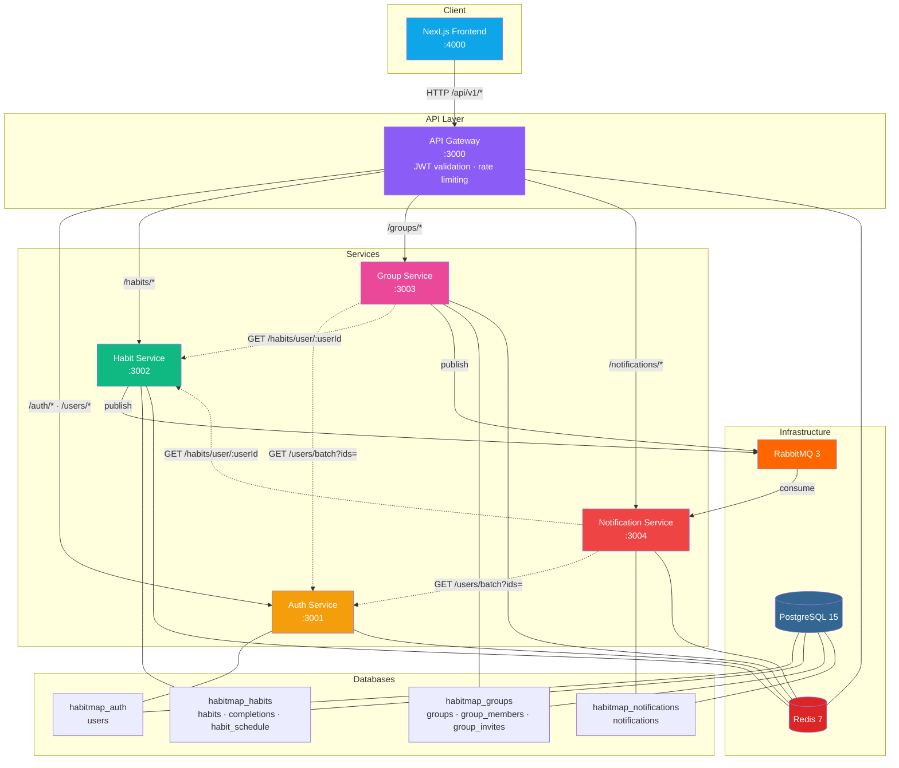
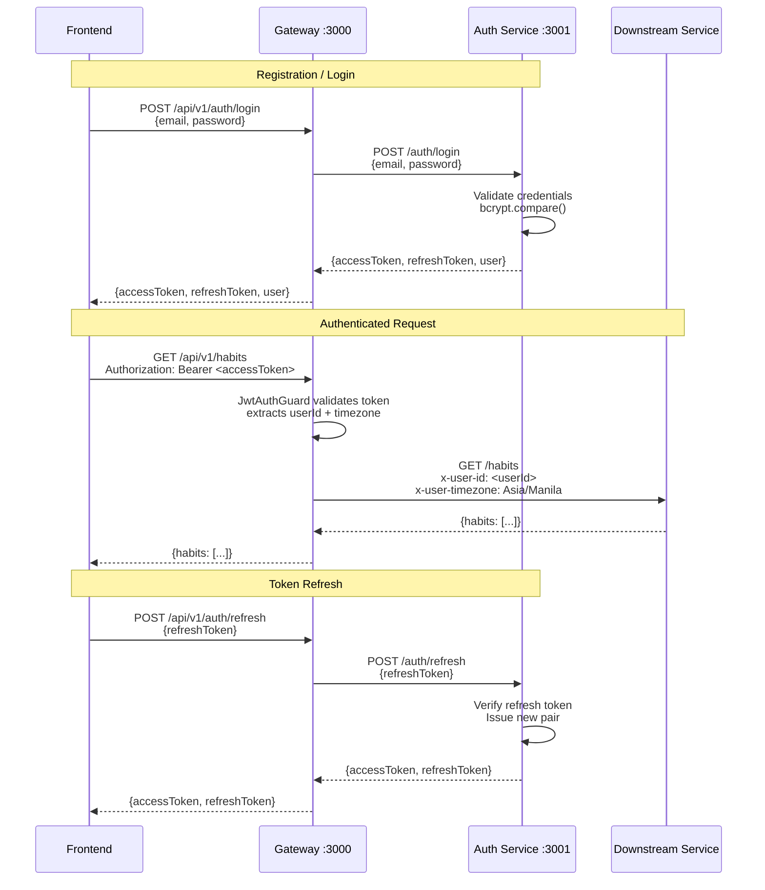
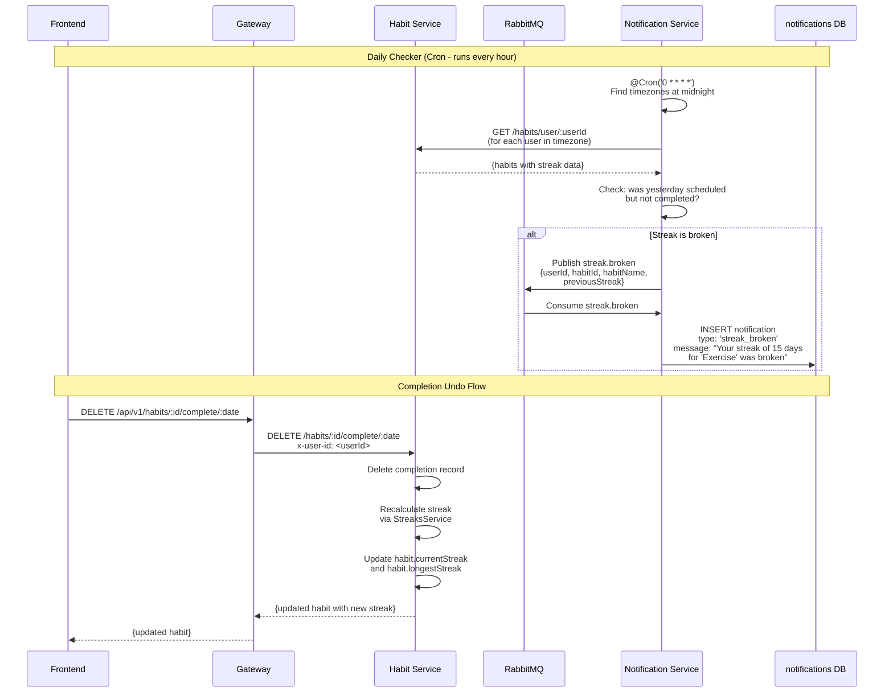

# HabitMap Architecture

## System Overview

HabitMap is composed of 5 NestJS microservices, a Next.js frontend, and shared infrastructure (PostgreSQL, Redis, RabbitMQ). Each service owns its own database and communicates via REST (synchronous) or RabbitMQ events (asynchronous).

## Service Topology

### Arrow Legend

| Style | Meaning |
|-------|---------|
| Solid | Synchronous REST call (gateway → service) |
| Dashed | Internal service-to-service REST call (uses `x-internal-key` header) |
| Through RabbitMQ | Asynchronous event (publish → queue → consume) |

### Event Types via RabbitMQ

| Event | Publisher | Consumer | Trigger |
|-------|-----------|----------|---------|
| `habit.completed` | Habit Service | Notification Service | User checks off a habit |
| `streak.milestone` | Habit Service | Notification Service | Streak hits 7, 30, 60, or 100 |
| `streak.broken` | Habit Service | Notification Service | Daily checker detects missed day |
| `member.joined` | Group Service | Notification Service | User joins a group via invite |

---

## Authentication Flow

---

## Streak Broken Notification Pipeline

This sequence shows what happens when a user undoes a completion, potentially breaking a streak, and how the notification propagates.

---

## Service Responsibilities and Data Ownership

### API Gateway (port 3000)

**Owns**: No database

The gateway is the single entry point for all client requests. It validates JWTs issued by the auth service, applies rate limiting (100 requests/60s via `@nestjs/throttler`), and proxies requests to downstream services. It injects `x-user-id` and `x-user-timezone` headers so downstream services never need to parse JWTs themselves.

### Auth Service (port 3001)

**Owns**: `habitmap_auth` database — `users` table

Handles user registration, login, JWT issuance (access + refresh tokens), and user profile management. Exposes internal endpoints (`GET /users/:id`, `GET /users/batch`) for other services to resolve user IDs to usernames. Internal endpoints are protected by a shared `x-internal-key` header.

### Habit Service (port 3002)

**Owns**: `habitmap_habits` database — `habits`, `completions`, `habit_schedule` tables

The core domain service. Manages habit CRUD, daily completions, and the streak calculation engine. The streak algorithm is timezone-aware and supports both daily and custom (specific days of week) schedules. Publishes `habit.completed` and `streak.milestone` events to RabbitMQ when completions are recorded. Exposes `GET /habits/user/:userId` for the group service leaderboard and notification daily checker.

### Group Service (port 3003)

**Owns**: `habitmap_groups` database — `groups`, `group_members`, `group_invites` tables

Manages accountability groups, membership, and invite codes. The leaderboard endpoint aggregates data from both the auth service (usernames) and habit service (streak data) via synchronous REST calls. Publishes `member.joined` events when users join groups.

### Notification Service (port 3004)

**Owns**: `habitmap_notifications` database — `notifications` table

Consumes all events from RabbitMQ (`habit.completed`, `streak.milestone`, `streak.broken`, `member.joined`) and persists them as user-facing notifications. Runs a daily checker cron job every hour that identifies users whose midnight just passed, checks their habits for broken streaks, and creates notifications accordingly.

---

## Infrastructure

### PostgreSQL 15

Single PostgreSQL instance with 4 separate databases (created by `scripts/init-databases.sql`). Each service uses Prisma with its own schema and migrations, ensuring complete data isolation.

### Redis 7

Shared Redis instance with database-number namespacing:
- `db 0` — Gateway (rate limiting)
- `db 1` — Auth Service (refresh token blacklist)
- `db 2` — Habit Service (streak caching)
- `db 3` — Group Service (leaderboard caching)
- `db 4` — Notification Service (unread count caching)

### RabbitMQ 3

Single queue (`habitmap_events`) with durable messaging. The habit service and group service publish events; the notification service consumes them. Management UI available at `http://localhost:15672` (guest/guest).
